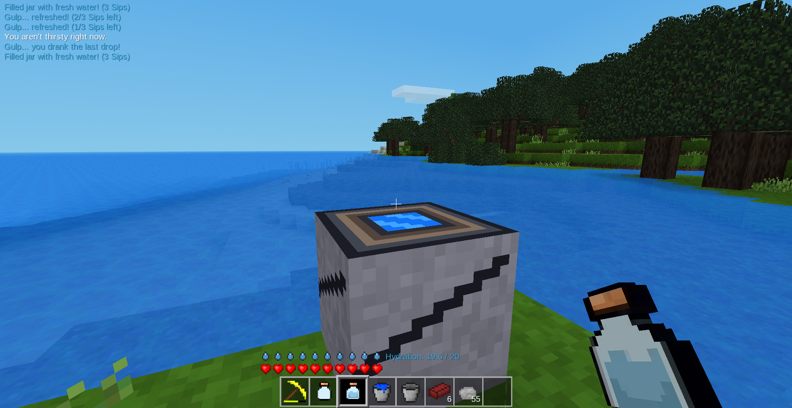

# Hydration Mod for Luanti (Minetest)

A hardcore survival mechanics and fluid logistics mod designed specifically for deep underground mining, exploration, and cave management. This mod introduces an immersive visual interface, tactical item limits, and realistic environmental rules to enhance the survival experience.



## Core Features

* **Visual Status HUD:** Introduces a beautiful row of **10 pixel-art water drop icons** (20-point native statbar system) locked parallel to your health hearts, accompanied by a precise decimal tracker (e.g., `Hydration: 20.0 / 20.0`).
* **Exertion-Based Drainage:** Standing still or walking drains water slowly, but heavy physical work like **digging mining tunnels or jumping burns through your water drops 3x faster**.
* **Multi-Sip Clay Jars:** Crafted empty clay jars can be filled from deep water sources. Once filled, they gain **3 interactive liquid charges** that dynamically update item descriptions in your backpack (e.g., `2/3 Sips left`).
* **Space-Locked Hotbar Inventory:** Filled jars are restricted to a **maximum stack size of 3 items per slot** to enforce inventory management.
* **Heavy Hauling Bucket Support:** Allows the use of standard iron water buckets and river water buckets to instantly dump heavy liquid loads into the Cistern, filling it by **50% (+25 Liters)** in a single splash.
* **Anti-Cheat Validation:** Scans the coordinates surrounding players underground. **Blocks players from cheating** by dropping a water bucket on a flat cave floor to infinitely refill their jars from an isolated puddle.
* **Dynamic Storage Barrel:** Features a detailed terracotta clay barrel texture. The top face dynamically updates from a dark hollow opening to a brimming blue pool depending on its volume percentage status.
* **Pickaxe Weight Blocker:** If the storage barrel contains *any* liquid inside, **it becomes impossible to mine or pick up** in both Survival and Creative mode until it is fully drained.
* **Full Audio Immersion:** Includes custom positional monophonic sound configurations for **drinking** (gulping feedback), **pouring** (rushing stream), **scooping** (splash), and **dehydration** (heavy heartbeat alarm sound when taking damage at zero water).

---

## Centralized Configuration (`config.lua`)

You can balance your entire survival gameplay loop inside one central file without touching core mod files. Options include:
* Custom maximum thirst limits and values restored per sip.
* Adjustable drainage speeds for standing, walking, and digging.
* Customized maximum cistern/barrel volume thresholds.
* Minimum neighbor source constraints for the underground anti-cheat sensor.

---

## Project Structure

```text
hydration/
├── mod.conf             # Mod declaration name, description, and dependencies
├── config.lua           # Global customizable parameters and balance dials
├── init.lua             # Primary core engine, HUD tracking, and background ticker loop
├── blocks.lua           # Percentage-based storage barrel states and digging blocks
├── containers.lua       # Clay jar logic, recipes, hotbar space locker, and anti-cheat
├── textures/            # Compiled .png voxel textures folder
└── sounds/              # 3D monophonic .ogg audio asset triggers folder
```

---

## Installation & Asset Generation

1. Download or clone this repository into your Luanti `mods/` directory.
2. Drop your monophonic `.ogg` files into the `sounds/` directory matching the code assignments (`hydration_drink.ogg`, `hydration_pour.ogg`, `hydration_scoop.ogg`, `hydration_heartbeat.ogg`).
3. Activate the mod in your world settings and enjoy your survival expedition!

## Support the Project

If you enjoy managing your underground hydration logistics and want to support the development of future features (like Iron Water Pipes and Hand Pumps), feel free to buy me a coffee!

* **Solana (SOL):** `Gig76iFFAWFSBer3fwMzbYuqhhaoSKDBvdRPaHLeEbKj`
* **EVM (BSC):** `0x650655946D3A27C9db5A3C4fFBC07D21922D876c`
